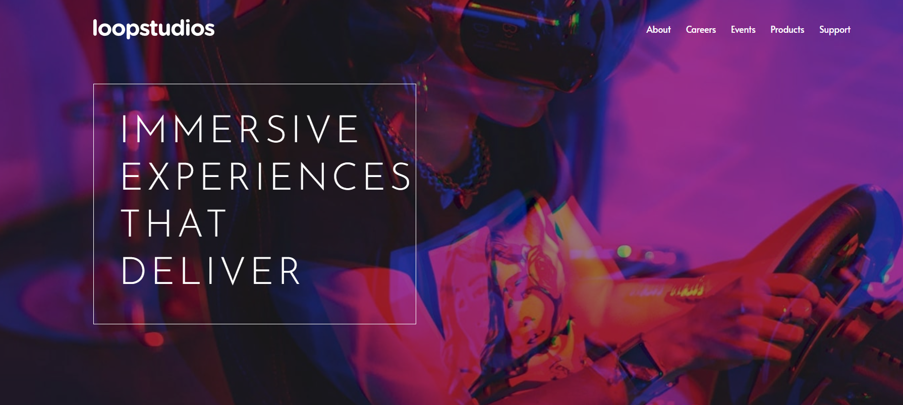

# 🏝️ Proyecto: Loopstudios Landing Page

Este proyecto consiste en el desarrollo de la **landing page de Loopstudios** utilizando **Astro** y **Tailwind CSS**.  
El objetivo es aplicar los conocimientos sobre **componentes de Astro**, **maquetación**, **estilos responsivos** y **utilidades CSS** para construir un diseño limpio, moderno y adaptable a diferentes dispositivos.

---

## 📖 Descripción general

### 🧩 Vista previa del proyecto
Agrega aquí una **captura de pantalla** del resultado final de tu landing page.  

---

### 🔗 Enlaces del proyecto

- **Repositorio en GitHub:** [https://github.com/AxelRodriguez-dot/Loopstudios-Landing-Page](https://github.com/)
- **Sitio desplegado (opcional):** [Agrega aquí la URL del proyecto desplegado, si usaste Vercel o Netlify](https://)

---

## 🧠 Proceso de desarrollo

### 🛠️ Tecnologías utilizadas
Lista las herramientas y tecnologías que utilizaste en el proyecto. Por ejemplo:

- [Astro](https://astro.build)
- [Tailwind CSS](https://tailwindcss.com/)
- HTML5 semántico
- Diseño responsivo (Mobile-first)
- Componentes de Astro reutilizables
- Interacciones con JavaScript (opcional para el toggle del menú móvil)

---

### 💡 Lo que aprendí
En esta sección describe brevemente **qué aprendiste o reforzaste** al desarrollar este proyecto.  
Puedes incluir fragmentos de código o mencionar conceptos nuevos que aplicaste.

aprendi a como es que se hacen secciones a bloques con las imagenes aqui en tailwind con la ayuda de astro

### 🚀 Áreas de mejora

- Implementar animaciones o transiciones suaves.  
- Explorar el uso de variables de Tailwind personalizadas. 
- Optimizar la estructura del proyecto y el uso de componentes a unos mas simples.  

### 📚 Recursos útiles

Incluye los enlaces, documentación o tutoriales que te ayudaron a completar este proyecto.

- [Documentación de Astro](https://docs.astro.build)  
- [Guía oficial de Tailwind CSS](https://tailwindcss.com/docs)  
- [MDN Web Docs - HTML y CSS](https://developer.mozilla.org/es/)  
- [Guía de diseño responsivo](https://web.dev/responsive-web-design-basics/)  

---

### 👩‍💻 Autor

- **Nombre completo:Axel Johab Rodriguez Ortiz**  
- **Carrera:TICS**  
- **Grupo:11-12**  
- **Correo institucional:23151212@aguascalientes.tecnm.mx**  

---

### ✨ Reflexión final

Comparte brevemente tu experiencia durante el desarrollo del proyecto.  
Puedes responder a preguntas como:

- ¿Qué fue lo más fácil o lo más difícil de realizar?  un poco mas facil que el anterior puesto que conprendi mejor el como usar los componentes de astro para poder simplificar el trabajo
- ¿Qué parte disfrutaste más del desarrollo?  Ninguna
- ¿Qué conceptos nuevos aprendiste?  la separacion en loques y el fotter en astro con tailwind
- ¿Cómo aplicarías lo aprendido en proyectos futuros? preferiria no aplicarlo y usar algo mas simple aunque consuma mas recursos

